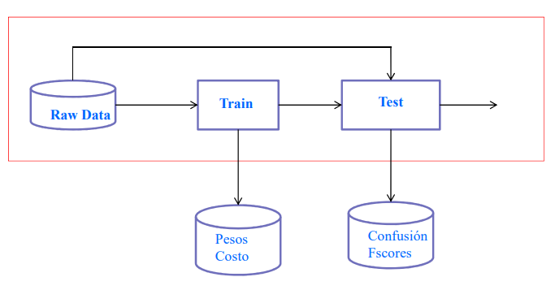

# Extreme Deep Learning (EDL) for IDS
Implementar y evaluar el rendimiento de un sistema de detección de intrusos usando un método de aprendizaje profundo extremo basado sobre el método de al matriz pseudo-inversa y algoritmo mAdam.

## Objetivos
- Implementar el proceso de entrenamiento del Extreme Deep Learning para tráfico normal y tráfico de ataques.
- Implementar proceso de testing del Extreme Deep Learning.

## Etapas

